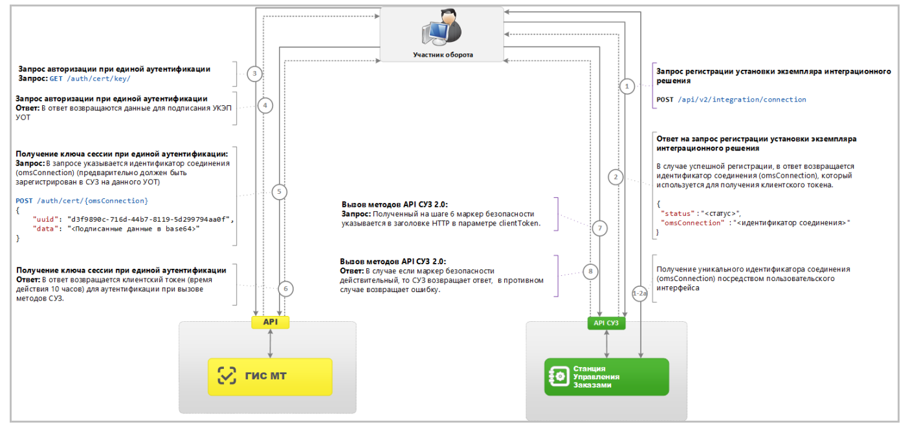
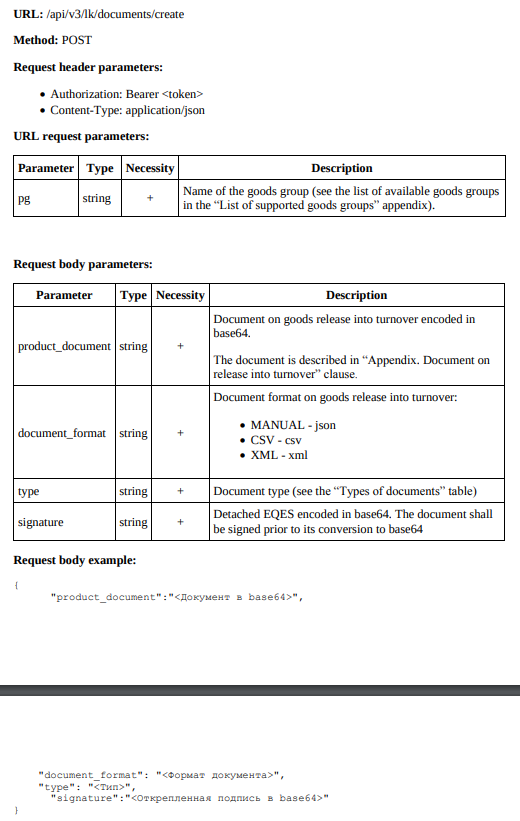
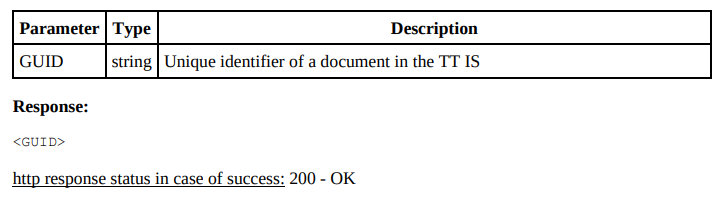
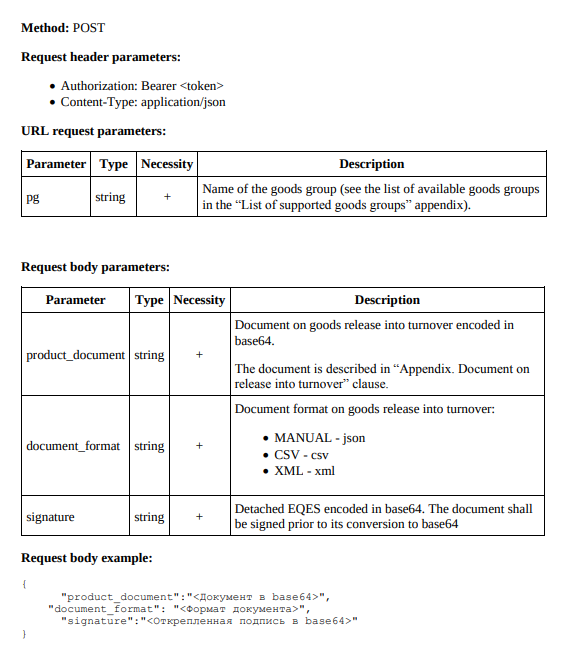

# Данный набор методов предназачен для работы с API системы маркировки "Честный Знак"  

### Получение авторизационного токена  
Для получения аутентификационного токена необходимо запросить в TT IS массив случайных данных
(GET /api/v3/auth/cert/key), подписать их КЭЧ и отправить в ИС ТТ для проверки
(POST /api/v3/auth/cert/). В случае успешной проверки подписи ИС ТТ возвращает токен аутентификации в формате jwt (см. jwt.io)  
  

### Создание документа  
#### Запрос  
  

#### Ответ  
  

### Выпуск в оборот. Контракт производство в Российской Федерации  
#### Запрос  
  
#### Ответ  
  
